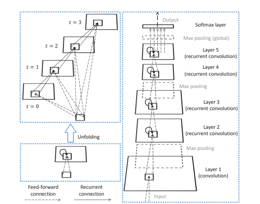
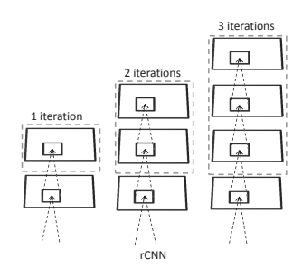
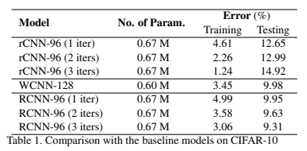

# Recurrent Convolutional Neural Network for Object Recognition

### Abstract

최근 몇년간 CNN(Convolutional Neural Network)은 컴퓨터 비전 분야에서 굉장한 성공을 거뒀다. 뇌 과학에서 영감을 얻어 CNN은 뇌의 시작부분과 많은 속성을 공유한다. CNN과의 중요한 차이는 CNN은 순전파 구조이지만 Visual system에선 반복적인 연결이 풍부하다는 것이다. 이 사실에서 영감을 얻어, 우리는 각각의 Convolution Layer를 통해 통합되는 연결에 의한 Object recognition을 위한 recurrent CNN(RCNN)을 제안한다. 고정된 입력을 통해 이웃된 활성화한 유닛과 연동된 활성된 RCNN유닛은 시간에 따라 진화한다. 이 이론은 객체 인식에 중요한 정보를 통합하는 모델의 능력을 향상 시켰다. 다른 recurrent neural network들 처럼, 시간에 따른 RCNN의 전개는 고정된 수의 parameter를 가진 임의의 깊은 네트워크를 생성 할 수 있었다. 그 뿐만 아니라, 펼쳐진 네트워크는 학습을 용이하게 하는 여러개의 경로를 가지고 있다. 모델은 네개의 유명한 object recognition dataset 위에서 테스트 되었다. : CIFAR-10, CIFAR-100, MNIST and SVHN. 학습 가능한 parameter가 적은 RCNN은 다른 모델들 보다 모든 dataset에서 성능이 뛰어나다. parameter의 증가는 더욱 좋은 performance를 보여준다. 이러한 결과는 object recognition에서 recurrent structure의 장점을 증명한다.

## 1.Introduction

최근 몇 년 동안 컴퓨터 비전 분야에서 합성곱 신경망(Convolutional Neural Network, CNN)이 급격히 발전해왔습니다. CNN은 여러 벤치마크 데이터셋에서 객체 인식 정확도를 획기적으로 높였으며, 예를 들어 ImageNet 데이터셋의 120만 개 이미지로 학습된 CNN 모델은 1000개의 객체 범주를 기존의 수작업 특징 기반 모델보다 훨씬 높은 성능으로 분류해 냈습니다. 또한, 사전 학습된 CNN 모델의 특징들은 다른 데이터셋에서도 우수한 결과를 보였습니다​

CNN은 1943년 제안된 첫 인공 뉴런에서 기원한 인공 신경망의 한 유형으로, 신경과학에서 유래되었다. CNN 및 기타 계층 모델(Neocognitron 및 HMAX)은 1차 시각 피질(v1)에서 단순 세포와 복합 세포에 대한 Hubel과 Wiesel의 연구와 밀접한 관련이 있다. 이 모델들은 모두 순방향구조(feed-forward architecture)를 가지며, 이는 생물학적 신경망을 단순화한 형태로 볼 수 있다. 그러나 해부갛적 증거에 따르면 대뇌 피질에는 순환 연결(Recurrent Connection)이 널리 존재하며, 이러한 순환 시냅스가 Feed-forward 및 Feedback 시냅스보다 더 많다. 순환 시냅수와 피드백 시냅스 덕분에 객체 인식은 입력이 정적임에도 불구하고 사실 동적 과정으로 이루어진다.

시각 신호의 처리는 주변 맥락에 의해 강하게 조절되며, 이러한 맥락 조절은 개별 뉴런의 반응에서도 관찰된다.[12] 예를 들어, V1 뉴런의 반응 특성은 수용 영역(receptive field, RF) 주변의 맥락에 따라 다양하게 변경될 수 있다.[42]

객체 인식에서 맥락 정보는 중요하다.(Figure 1) feed-forward model은 상위 층에서만 맥락 정보(the face in Figure 1)를 포착할 수 있지만, 이 정보는 더 작은 객체를 인식하는 하위 층의 유닛 활동을 조절하지는 못한다.(the nose in Figure 1) 이를 해결하기 위해, 상향 연결(top-down connections or feedback)을 사용해 상위 층의 정보를 하위 층으로 전파하는 방법(합성곱 심층 신뢰망, Convolutional deep belief network, CDBN)이 있지만 본 연구에서는 다른 접근법으로 동일한 층 내에서의 연결을 사용하는 전략을 제안한다. 

본 논문에서는 정적 객체 인식을 위한 순환 합성곱 신경망(recurrent CNN)을 제안한다. 구조는 Figure 2에 있으며, Feed-forward와 순환 연결이 모두 국소적인 연결을 가지며 서로 다른 위치에서 weight를 공유한다. 이 구조는 동적 제어에 자주 사용되는 순환 다층 퍼셉트론(Recurrent Multilayer Perceptron, RMLP)과 매우 비슷하다.(Figure 2, middle) 주요 차이점은 RMLP의 전체 연결이 MLP와 CNN간의 차이와 마찬가지로 공유된 국소 연결로 대체된 것이다.[40] 이러한 이유료, 제안된 모델을 순환 합성곱 신경망(RCNN)으로 명하였다.

제안돤 RCNN은 여러 object recognition dataset에서 테스트 되었다. RCNN은 더 적은 parameter를 사용하면서 모든 데이터 셋에서 기존의 최신 CNN보다 더 좋은 결과를 달성했으며, 이는 CNN에 비해 RCNN의 우수성을 입증한다. 나머지 내용은 다음과 같이 구성된다. 2장에서는 관련 연구를 검토하고, 3장에서는 RCNN의 아키텍처를 설명한다. 4장에서는 실험 결과와 분석을 제시하며, 마지막으로 5장에서 본 논문을 결론짓는다.

## 2.Related work

### 2.1 Convolutional neural networks

Hubel과 Wiesel이 고양이 시각 피질에 대해 발견한 획기적인 연구[23][22]에 영감을 받아 Fukushima[13]는 단순 유닛 층과 복합 유닛 층이 쌍을 이루어 쌓여있는 구조인 Neocognitron이라는 계층적 모델을 제안했다. 최초의 CNN은 LeCun 등[28][27]에 의해 제안되었습니다. 기본적으로 CNN은 단순 유닛의 수용 영역을 학습하기 위해 역전파(Back-propagation, BP)알고리즘을 통합함으로서 Neocognitron과 차이가 있다. 탄생 이후 CNN은 국소 연결, 가중치 공유 및 국소 pooling의 특징을 가진다. 첫 번째와 두 번째 특징은 모델이 다층 퍼셉트론(MLP)보다 적은 매개변수로 유용한 지역 사각 패턴을 발견할 수 있게 한다. 세 번째 특성은 네트워크에 어느 정도의 변환 불변성(translation invariance)을 부여한다. Saxe 등[41]의 연구에 따르면, CNN의 뛰어난 성능은 이러한 특성들에 크게 기인하며, 무작위 가중치를 가진 특정 구조도 좋은 결과를 낼 수 있다고 한다. 

지난 몇 년 동안 CNN의 성능을 향상시키기 위한 다양한 기술들이 개발되었다. ReLU 함수(Rectified Linear Function) [14]는 역전파(BP) 알고리즘에서 흔히 발생하는 기울기 소실 문제(gradient vanishing effect)에 강한 저항성을 지녀, 가장 일반적으로 사용되는 활성화 함수가 되었다. 드롭아웃(Dropout) [48]은 학습 과정에서 신경망이 과적합되는 것을 방지하는 효과적인 기법이다. Goodfellow 등[17]은 드롭아웃의 모델 평균화 기능을 활용하기 위해 활성화 함수로 특징 채널에 대한 최대 풀링(max pooling)을 사용했다. 합성곱 유닛의 비선형성을 강화하기 위해, Lin 등[33]은 Network in Network (NIN) 구조를 제안했으며, 여기서 합성곱 연산은 입력 특징 맵 위를 슬라이딩하는 국소 다층 퍼셉트론(MLP) [39]으로 대체되었다. NIN이 과적합되는 것을 방지하기 위해 완전 연결 층 대신 전역 평균 풀링 층(global average pooling layer)이 사용되었다. Simonyan과 Zisserman[44]은 작은 필터의 스택이 동일한 매개변수를 가진 큰 필터보다 더 강한 비선형성을 갖는다는 점을 고려하여, 3×3 합성곱을 사용해 매우 깊은 네트워크를 구축했다. Szegedy 등[50]은 다중 스케일 인셉션 모듈(multi-scale inception modules)을 제안하고 이를 바탕으로 GoogLeNet을 구축했으며, 이 모델에서도 작은 필터가 선호되었다. CNN은 계산 집약적인 모델이어서 CPU로 실행하기 어려운 경우가 많다. GPU의 사용은 CNN의 대규모 데이터셋에 대한 학습과 테스트를 크게 용이하게 했다. CNN의 첫 성공적인 GPU 구현은 ImageNet 대규모 시각 인식 챌린지(ILSVRC) 2012에서 우승한 AlexNet [26]이며, 그 이후 매년 이 대회에 출품된 대부분의 모델은 GPU를 기반으로 한 CNN이다.

### 2.2 Recurrent neural networks

순환 신경망(Recurrent neural network, RNN)은 인공 신경망 분야에서 오랜 역사를 가지고 있다.[4, 21, 11, 37, 10, 24] 그러나 RNN의 성공적인 응용 대부분은 필기 인식[18]이나 음성 인식[19]과 같은 순차 데이터(sequentail data) 모델링에 관련되어 있다. 정적 시각 신호 처리에 RNN을 적용한 몇 가지 연구가 아래에서 간략히 소개된다.

[20]에서는 다차원 RNN(Multi-dimensional RNN, MDRNN)을 오프라인 필기 인식을 위해 제안했다. MDRNN은 이미지를 2차원 순차 데이터로 처리하는 방향성 구조를 가지고 있다. 또한, MDRNN은 단일 은닉층을 가지므로 CNN과 같은 특징 계층 구조를 생성할 수 없다.

[2]에서는 Neural Abstraction Pyramid(NAP)이라는 계층적 RNN을 이미지 처리를 위해 제안했다. NAP은 생물학에서 영감을 받은 아키텍처로 수직 및 횡방향 순환 연결을 통해 이미지 해석이 점진적으로 정제되어 시각적 모호성을 해결한다. 구조 설계 시, 생물학적 타당성이 강조되었다. 예를 들어, 대부분의 딥러닝 모델에서는 고려되지 않는 흥분성 유닛과 억제성 유닛(excitatory and inhibitory unit)을 사용한다. 더 중요한 것은, NAP의 일반적인 프레임 워크에는 순환 및 피드백 연결이 있지만 객체 인식을 위해서는 feed-forward version만 테스트되었다. 순환 NAP은 이미지 재구성(image reconstruction)과 같은 다른 작업에 사용되었다.

NAP 외외에도 일부 다른 계층적 모델에선 top-down 연결이 사용되었다. Lee 등[31]은 비지도 특징 학습을 위해 CDBN(Convolutional deep belief network)을 제안했다. 추론 과정에서 최상위 층의 정보가 중간 층을 거쳐 최하위 층으로 전달될 수 있다. 이 층별 전파 아이디어와는 달리, Pinheiro와 Collobert[36]은 CNN의 최상위 층에서 최하위 층으로 직접 연결되는 추가 연결을 사용했다. 이 모델은 장면 레이블링(scene labeling)에 사용되었다. 이러한 모델들은 RCNN과 다르다. RCNN에서는 동일한 층 내에서 순환 연결이 존재하며 층 간 연결이 아니다.

RCNN과 일부 코딩 모델(Sparse coding models) 간에는 흥미로운 관계가 있습니다.[15] 이 모델들에서는 고정점 업데이트(Fixed-point updates)가 추론에 사용되며, 반목 최적화 과정이 암묵적으로 순환 신경망을 정의한다. 지도 학습 기법이 희소 코딩 모델의 비지도 학습 프레임 워크에 통합될 수 있음을 유의하세요[3] 그러나 이러한 기법이 희소 코딩 모델을 객체 인식을 위한 CNN과 경쟁할 수 있을만큼 성능을 높이지 못했다.

마지막으로 우리의 모델은 재귀 층이 동일한 가중치를 공유하는 층의 스택으로 펼쳐지는 재귀 신경망(Recursive neural network)과도 관련이 있다.[46] Socher 등[45]은 장면 구문 분석(Scene parsing)을 수행하기 위해 재귀 신경망을 사용했다. Eigen 등[9]은 재귀 합성곱 신경망을 사용하여 CNN 성능에 영향을 미치는 요인들을 연구했으며, 이는 RCNN의 시간-전개(time-unfolded) 버전과 동일하지만, 각 전개된 층에 feed-forward 입력이 없는 구조이다.

## 3. RCNN Model

### 3.1. Recurrent convolutional layer

RCNN의 핵심 모듈은 recurrent convolutional layer(재귀적 합성곱 계층, RCL)이다. RCL 유닛의 상태는 이산 시간 단계에서 진화한다. RCL에서 𝑘번째 특징 맵에서 위치 
(𝑖,𝑗)에 있는 유닛의 시간 단계 𝑡에서의 순 입력 𝑧𝑖𝑗𝑘(𝑡)는 다음과 같이 주어진다.

$$
z_{ijk}(t) = (w^f_k)^T u_{(i,j)} + (w_k^\tau)^T x_{(i,j)} (t-1)+b_k\\
$$

이 식에서 𝑢(𝑖,𝑗)(𝑡)와 x(i,j)(t−1)는 각각 순전파 입력(feed-forward input)과 순환 입력(recurrent input)을 나타내며, 이는 이전 계층과 현재 계층의 특징 맵에서 (𝑖,𝑗)를 중심으로 한 벡터화된 패치다.
$w^f_k$와 $w^\tau_k$는 각각 벡터화된 순전파 가중치와 순환 가중치를 나타내며, $b_k$는 바이어스다. (1)식의 첫 번째 항은 일반적인 CNN에서 사용되고, 두 번째 항은 순환 연결에 의해 도입된 항이다.

이 유닛의 활성화 또는 상태는 그 순 입력의 함수로 정의되며, 수식은 다음과 같다.

$$
x_{ijk}(t) = g(f(z_{ijk}(t)))\\
$$

여기서 $f$는 ReLU(Rectified Linear Unit) 활성화 함수로 정의된다.

$$
f(z_{ijk}(t)) = max(z_{ijk}(t),0)\\
$$

또한 $g$는 지역 응답 정규화(Local Response Normalization, LRN) 함수이다.

$$
g(f_{ijk}(t)) = \frac{f_{ijk}(t)}{\left(1 + \frac{\alpha}{N} \sum_{k'=\max(0, k - N/2)}^{\min(K, k + N/2)} (f_{ijk'})^2\right)^{\beta}}
$$

여기서 $K$는 현재 계층에서 총 특징 맵의 수를 나타낸다. (4)식의 분모에서 합은 동일 위치 $(i,j)$의 $N$개의 특징 맵을 대상으로 수행된다. (일반적으로 $N < K$). 또한, $\alpha$와 $\beta$는 정규화의 크기를 조절하는 상수이다. 또한 $f(z_{ijk}(t))$를 간단히 $f_{ijk}(t)$로 표기했다.
LRN은 피질에서의 측방 억제(lateral inhibition)를 모방하여, 다양한 특징들이 높은 반응을 위해 경쟁하는 효과를 만든다. LRN은 모델 내 상태가 폭발하지 않도록 방지하는 데 사용된다.

  

그림 3. RCNN의 전체 아키텍처.
왼쪽: RCL은 $T = 3$ 타임스텝으로 펼쳐지며, 가장 깊은 경로는 깊이가 4, 가장 얕은 경로는 깊이가 1인 피드포워드 서브네트워크를 형성한다. $t = 0$ 에서는 피드포워드 연산만 수행된다.
오른쪽: 이 논문에서 사용된 RCNN은 하나의 합성곱 레이어, 네 개의 RCL, 세 개의 맥스 풀링 레이어, 그리고 하나의 소프트맥스 레이어로 구성되어 있다.

식 (1)과 (2)는 RCL(Recurrent Convolutional Layer)의 동적 동작을 설명한다. 이 레이어를 $T$ 시간 스텝으로 펼치면 깊이가 $T + 1$인 피드포워드 서브네트워크가 형성된다. $T = 3$인 예시는 그림 3의 좌측 상단에 나와 있다. 반복(iteration) 중에 순환(recurrent) 입력은 변화하지만, 피드포워드 입력은 모든 반복에서 동일하게 유지된다. $t = 0$일 때는 피드포워드 입력만 존재한다. 이 서브네트워크는 입력 레이어에서 출력 레이어로 이어지는 여러 경로를 가진다. 가장 긴 경로는 펼쳐진 모든 순환 연결을 통과하며(따라서 길이 = $T + 1$), 가장 짧은 경로는 피드포워드 연결만 통과한다(따라서 길이 = 1). RCL 유닛의 이전 레이어 피처 맵에서의 유효 수용장(effective RF)은 반복 횟수가 증가함에 따라 확장된다. 만약 식 $(1)$에서 입력 및 순환 필터가 각 피처 맵에서 정사각형 형태라면, RCL 유닛의 유효 수용장도 정사각형 형태를 가지며, 그 한 변의 길이는 $ (L_{rec}-1)T + L_{feed} $이다. 여기서 $L_{feed}$와 $L_{rec}$는 각각 입력 필터와 순환 필터의 한 변의 길이를 나타낸다.

### 3.2. Overall architecture

RCNN은 RCL의 스택으로 구성되어 있으며, 선택적으로 맥스 풀링 레이어와 교차 배치될 수 있다. 이 작업에서 사용된 아키텍처는 그림 3을 참조.
계산 비용을 절약하기 위해 1층은 반복 연결이 없는 표준 피드포워드 합성곱 레이어로 구성되며, 이후 맥스 풀링이 이어진다. 그 위에는 4개의 RCL이 사용되며, 중간에 맥스 풀링 레이어가 포함된다.
인접한 RCL 사이에는 피드포워드 연결만 존재한다. 두 풀링 연산은 모두 stride가 2고 size는 3이다. 네 번째 RCL의 출력 뒤에는 global max-pooling layer가 이어지며, 이는 각 특징 맵의 최대값을 출력하여
이미지를 나타내는 특징 벡터를 생성한다. 이는 [26]의 모델에서 사용된 Fully connected layer나 [33, 50]의 모델에서 사용된 global average pooling과는 다른 방식이다.
마지막으로 Softmax layer가 사용되어 특징 벡터를 $C$개의 카테고리로 분류하며, 그 출력은 다음과 같이 주어진다.

$$
y_k = \frac{\exp(w_k^T x)}{\sum_{k'} \exp(w_{k'}^T x)}
$$

여기서 $y_k$는 $k$번째 카테고리에 속할 확률을 예측한 값이고, $x$는 Global max-pooling을 통해 생성된 특징 벡터다.
학습은 시간 역전파 알고리즘(BPTT,Backpropagation Through Time) [52]을 사용하여 크로스엔트로피 손실 함수(cross-entropy loss function)를 최소화함으로써 수행된다. 
이는 시간으로 펼쳐진 네트워크에 대해 표준 역전파(BP, Backpropagation) 알고리즘을 사용하는 것과 동일하다. 
공유 가중치(shared weight)에 대한 최종 gradient는 모든 시간 단계에서 계산된 gradient의 합으로 나타난다.

재귀 연결을 $T$ 타임스텝 동안 펼치면, 이 모델은 깊이가 매우 깊은 피드포워드 네트워크가 된다. 이때 매개변수화된 층(parameterized layer)의 개수는 $4(T+1)+2$가 된다.
여기서 $T+1$은 각 RCL의 깊이를 의미한다. 하지만 $4(T+1)+2$는 입력층에서 출력층까지의 가장 긴 경로의 길이일 뿐이며, 다른 길이를 가진 많은 경로들이 존재한다. 이 중에서 가장 짧은 경로는 재귀 연결을 모두 우회하는 피드포워드 경로로, 길이가 6이다.

### 3.3. Discussion

계산적 관점에서 볼 때, RCNN의 재귀 연결(recurrent connections)은 여러 가지 장점을 제공한다. 첫째, 재귀 연결은 현재 레이어에서 각 유닛이 임의로 큰 영역의 문맥 정보를 통합할 수 있도록 한다. 실제로, 타임스텝이 증가함에 따라 (식 (1) 참조) 각 유닛의 상태는 현재 레이어에서 더 넓은 이웃 영역에 있는 다른 유닛들에 의해 영향을 받는다. 결과적으로, 해당 유닛이 입력 공간에서 "볼 수 있는" 영역의 크기도 커지게 된다.

반면에, CNN에서는 현재 레이어의 유닛들이 가지는 수용 영역(Receptive Field, RF)의 크기가 고정되어 있다. 따라서 더 큰 영역을 "볼 수 있는" 것은 상위 레이어에 있는 유닛들에만 가능하다. 하지만 상위 레이어의 유닛들이 보는 문맥 정보는 하향식(top-down) 연결이 없는 한 현재 레이어의 유닛 상태에 영향을 미칠 수 없다.

둘째, 재귀 연결(recurrent connections)은 가중치 공유(weight sharing)를 통해 조정 가능한 매개변수의 개수를 일정하게 유지하면서 네트워크의 깊이를 증가시킨다. 이는 현대 CNN 아키텍처의 경향과 일치하는데, 상대적으로 적은 수의 매개변수로 더 깊은 구조를 만드는 방향이다 [33, 44, 50].

단순히 CNN의 깊이를 증가시키고 레이어 간에 가중치를 공유한다고 해서 RCNN과 동일한 깊이와 동일한 매개변수 수를 가진 모델을 만들 수는 있지만, 이러한 모델은 RCNN의 성능에 필적하지 못할 수 있다. 이는 우리의 실험(섹션 4.2.1 참조)을 통해 검증되었다. 우리는 이러한 결과가 너무 깊은 모델을 학습하는 데 따르는 어려움 때문이라고 본다.

이제 RCNN의 세 번째 장점이 등장한다. RCNN을 시간 축으로 펼치면(Figure 3), 입력층에서 출력층까지 여러 경로를 가지는 CNN이 된다. 이러한 구조는 학습을 용이하게 할 수 있다.

한편으로는, 더 긴 경로의 존재가 모델이 매우 복잡한 특징을 학습할 수 있도록 해준다. 다른 한편으로는, 더 짧은 경로의 존재가 학습 과정에서 그래디언트 역전파를 도울 수 있다.

멀티-패스(Multi-path) 구조는 [50, 30]에서도 사용되었지만, 해당 모델에서는 깊은 네트워크를 학습하는 데 따르는 어려움을 완화하기 위해 숨겨진 레이어(hidden layers)에 추가적인 목적 함수(objective functions)가 사용되었다. 반면, RCNN에서는 이러한 추가 목적 함수를 사용하지 않는다.

### 3.4. Implementation

RCNN의 성능에는 특징 맵의 개수와 각 레이어의 필터 크기와 같은 다양한 하이퍼파라미터가 영향을 미칠 수 있다. 우리는 최적의 설정을 탐색하지 않고, 제한된 하이퍼파라미터 공간 내에서 검색을 제한하였다.

먼저, 레이어 1부터 5까지는 동일한 수의 특징 맵 $K$ 를 가지도록 제약을 두었다. 따라서 모델은 $RCNN - K$로 표현될 수 있다. 예를 들어, $RCNN - 96$은 다섯 개의 레이어 각각이 96개의 특징 맵을 가진다는 것을 의미한다. 둘째, 레이어 1에서 피드포워드 필터 크기는 $5 * 5$, layer 2에서 4까지의 피드포워드 및 재귀 필터 크기는 모두 $3 * 3$으로 설정되었다. 따라서 $RCNN-K$의 총 매개변수 수는 약 $72K$이며, 이는 주로 RCL의 가중치에 해당된다. 다른 레이어들은 훨씬 적은 매개변수를 가지고 있기 때문이다.

식 (4)에서 LRN(Local Response Normalization)의 하이퍼파라미터는 ${\alpha} = 0.001$, ${\beta} = 0.001, N = K/8 + 1$로 설정되었다. 드롭아웃(Dropout) [48]은 레이어 5를 제외한 각 RCL 이후에 적용되었으며, 레이어 5는 소프트맥스 레이어와 연결되었다. 만약 RCL 다음에 풀링 레이어가 있다면, 드롭아웃은 풀링 이후에 배치되었다.

## 4. Experiments

  

figure 4. rCNN을 구성하기 위해 사용된 서브네트워크
이 버스네트워크들은 RCNN의 RCL을 대체하는 데 사용된다. 점선으로 둘러쌓인 레이어들은 가중치를 공유(tied weights)한다. 왼쪽에서 오른쪽으로, 서브네트워크는 각각 한 번, 두 번, 세 번의 반복(iteration)을 가진 RCL에 해당한다.

### 4.1. Overall settings

RCNN은 Alex Krizhevsky가 개발한 cuda-convnet2 [26]를 사용하여 구현되었다. 실험은 데이터 병렬 처리(data parallelism)를 통해 두 개의 GPU에서 실행되었다. 모델은 CIFAR-10 [25], CIFAR-100 [25], MNIST [29], 그리고 SVHN [35]의 네 가지 벤치마크 객체 분류 데이터셋에서 평가되었다. RCNN의 동적 프로세스를 몇 번만 반복(iteration)해도 우수한 결과를 얻을 수 있었다. CIFAR-10에서는 서로 다른 반복 횟수를 비교했지만, 나머지 세 데이터셋에서는 반복 횟수를 3으로 고정하였다.

훈련 절차는 [26]을 따랐다. 모델은 BPTT(Backpropagation Through Time) 알고리즘과 확률적 경사 하강법(Stochastic Gradient Descent, SGD)을 결합하여 훈련되었다. 초기 학습률은 경험적으로 설정되었으며, 검증 세트에서 미리 결정된 일정에 따라 감소되었다.

정확도가 더 이상 향상되지 않을 때, 학습률은 이전 값의 1/10로 줄어들었다. 총 세 번의 감소 단계를 거쳤으며, 최종 학습률은 초기 값의 1/1000이 되었다.

모든 데이터셋에 대해 모멘텀(momentum)은 0.9로 고정되었다. 드롭아웃(dropout) 외에도 가중치 감소(weight decay)가 추가적인 정규화 기법으로 사용되었다. 모델의 모든 가중치에는 동일한 감소 항목이 적용되었다. 드롭아웃 확률과 가중치 감소율은 조정되었다.

CIFAR-10, CIFAR-100, 그리고 SVHN의 경우, 이미지의 전처리는 학습 세트에서 계산된 각 픽셀의 평균값을 제거하는 방식으로 이루어졌다. 반면, MNIST는 별도의 전처리 없이 원본 이미지를 입력으로 사용하였다.

### 4.2. CIFAR-10

CIFAR-10 데이터셋 [26]은 10개의 클래스에 걸쳐 총 60,000개의 32×32픽셀의 컬러 이미지로 구성되어 있다. 전체 데이터셋은 50,000개의 학습 이미지와 10,000개의 테스트 이미지로 나뉘어 있다. 이 중 마지막 10,000개의 학습 이미지는 검증용으로 사용되었다.

하이퍼파라미터가 결정된 후, 모델은 50,000개의 학습 이미지를 모두 사용하여 처음부터 다시 훈련되었다.

#### 4.2.1 Comparison with baseline models

  

우리는 RCNN의 특성을 두 가지 기준 모델과 비교하여 분석하였다. 첫 번째 기준 모델은 RCNN에서 재귀 연결(recurrent connections)을 제거하여 구성한 것으로, 이는 일반적인 CNN이 된다. 공정한 비교를 위해 각 레이어에 더 많은 특징 맵(feature map)을 사용하여 모델의 매개변수 수를 RCNN과 대략 동일하게 맞췄다. 이 점을 강조하기 위해 이 모델을 WCNN(Wide CNN)이라고 명명하였다. 참고로 WCNN은 대부분의 레이어에서 3×3 필터를 사용하므로 VGG의 매우 깊은 모델 [44]과 유사하다.

두 번째 기준 모델은 RCNN의 각 RCL에서 재귀 연결을 제거하고, 중복된 합성곱 레이어의 캐스케이드(cascade)를 추가하여 구성되었다. 이 모델은 recursive CNN 또는 줄여서 rCNN이라고 불렸다. 중복된 합성곱 레이어의 캐스케이드는 𝑡=1부터 시작되는 RCL의 시간 확장된 버전으로 이해할 수 있으며, 이때 피드포워드 입력(식 (1)의 첫 번째 항)은 포함되지 않는다(그림 4). 즉, RCNN의 반복(iteration)에서는 항상 피드포워드 입력이 존재하지만, rCNN의 반복에서는 피드포워드 입력이 없다. figure 3의 왼쪽 상단과 figure 4를 비교해보라.

rCNN은 RCNN과 정확히 동일한 수의 매개변수를 가지고 있었다는 점을 주목할 필요가 있다.

RCNN-96이 비교를 위해 사용되었다. cuda-convnet2 [26]는 필터 개수가 16의 배수여야 하기 때문에, RCNN-96 및 rCNN-96(매개변수 약 0.67백만 개)과 가장 유사한 복잡도를 가진 WCNN-128(매개변수 약 0.6백만 개)을 선택하였다.

RCNN과 rCNN 모두에서 1회, 2회, 3회의 반복(iteration)이 테스트되었다. table 1은 비교 결과를 보여준다. test02